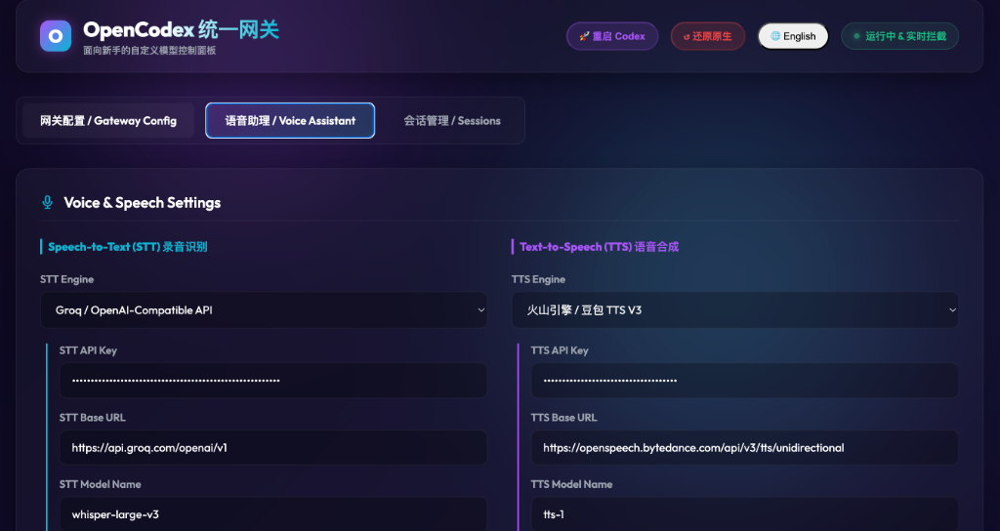

# OpenCodexBar 🍏🔊

[English](#english) | [简体中文](#简体中文)

---

<p align="center">
  
</p>

# English

**OpenCodexBar** is the premium, lightweight macOS companion client for **OpenCodex**. Running neatly in your macOS Status Bar, it provides global system-wide voice command hotkeys, real-time Audio-Reactive VAD, and a stunning widescreen Camera Notch visualizer HUD with full Mac Intelligence styling.

## 🌟 Key Features

* **Codex Desktop Integration (Zero-exec Stream Sync)**: Operates as a local API and WebSocket gateway, completely bypassing slow shell CLI execution loops. By directly taking over Codex Desktop's streaming pipeline, it matches and synchronizes voice interactions with Codex's native response speeds.
* **Interactive Widescreen Camera Notch HUD (Notch Visualizer)**:
  * Seamlessly integrates with the macOS Camera Notch (or screen top boundary).
  * Slides out smoothly from the notch when activated, and retracts completely with absolutely no residue on screen.
  * Live dynamic 60fps waveform syncing and scrolling state text typewriter animations.
  * Fully supports customized visualizer themes (Vortex / Siri Fluid Wave / Capsule Local Glow / Scanning Halo) mapped dynamically from your dashboard.
* **Audio-Reactive VAD (Voice Activity Detection)**:
  * Injects a `0.4s` warm-up mic decibel filter spike suppression to avoid hardware clicks.
  * Real-time local amplitude metering feeding directly into visualizer ripples.
  * Powered by a local high-performance **Silero VAD daemon** (via proxy) running real-time VAD checks every 160ms on new audio data (no buffer-alignment lag) with a dynamically adjustable silence threshold (e.g. `0.8s`).
* **Fast Global Hotkey (`Option-Space`) with Interrupt**: Toggle the visualizer HUD and microphone capture instantly. Pressing the hotkey while the assistant is active (listening, thinking, or speaking) will **instantly interrupt/stop** all operations, cleanly hide the visualizer HUD completely from the screen, and return to background standby (green dot in status bar stays alive). Pressing it again when idle starts listening instantly.
* **Notch Drop Zone**: Includes an interactive camera notch drop zone supporting drag-and-drop file imports, text clippings, and universal screen images for instant model prompts. Features click-through safety to avoid blocking standard screen clicks.
* **Stable OS Entitlements**: Pre-signed with Designated Requirements (DR) matching bundle identifiers, resolving recurring macOS permission prompts permanently.
* **One-Click Session Management**: Click status bar options or trigger via keyboard shortcut (`Option-N`) to instantly clear agent session memory and start a clean conversation thread.

## 🛠️ Setup & Compilation

### Prerequisites
* macOS 12.0+ (Apple Silicon or Intel)
* Xcode Command Line Tools installed (Swift compiler `swiftc` / SPM)
* **OpenCodex** Node.js server running in the background (`http://localhost:8765`)

### Quick Build & Run

```bash
git clone https://github.com/AITabby/opencodex-bar.git
cd opencodex-bar
swift build -c release
open .build/*/release/OpenCodexBar
```

---

# 简体中文

**OpenCodexBar** 是 **OpenCodex** 的高颜值、轻量级 macOS 原生系统菜单栏（Status Bar）伴侣应用。它为您提供系统级的全局语音指令热键、麦克风分贝联动、实时 VAD 停顿检测，以及一个极其惊艳的顶部流光刘海视觉舱（Notch Visualizer HUD）。

## 🌟 核心特性

* **Codex 桌面端直连集成（零 exec 流式同步）**：通过本地网关与 WebSocket 代理机制直接接管 Codex 桌面端的通信管道，彻底告别了以往通过命令行 `exec` 调用产生的明显物理延迟，实现语音交互速度与 Codex 桌面端原生响应速度近乎毫秒级的完全同步。
* **极光流光刘海视觉舱（Notch Visualizer HUD）**：
  * 完美契合并融合于 macOS 屏幕顶部的摄像头刘海区域（Camera Notch）。
  * 唤醒时从刘海平滑滑出展开，待机或停止时完全无缝缩回隐藏至刘海深处，不留任何残留像素。
  * 60fps 实时麦克风分贝波形联动与多行滚动打字机文本动画。
  * 支持控制台一键切换视觉主题（极光频谱 / Siri流体波形 / 胶囊边缘流光 / 赛博旋转扫描线）。
* **智能 VAD 噪音过滤与静音检测**：
  * 内置首个 `0.4` 秒硬件杂音/电流爆音抑制，避免灵敏度过高误触发。
  * 实时分贝幅值跟踪，同步渲染视觉动效。
  * 集成本地高性能 **Silero VAD 异步守护进程**（通过代理端），实现 160ms 级别无延迟实时分包检测，且静音切分时间（如 `0.8s`）支持在设置中动态调整，说话完毕自动收尾。
* **全局唤醒热键 (`Option-Space`) 与一键打断**：一键录音及面板升起。在任何活动状态下（倾听中、思考中、播放中），按下热键会**立刻无条件停止所有操作**并让悬浮刘海**完全无缝缩回隐藏**，不留任何像素痕迹，同时保持后台语音进程存活（状态栏小绿点保持激活）。在待机状态下再次按下，一键拉出并开始倾听。
* **极速拖拽刘海（Notch Drop Zone）**：内置屏幕顶部摄像头刘海交互拖拽区，完美支持各种跨屏/通用控制（Sidecar Universal Control）拖入的文件、文本片段以及网页图片，并自动转化为模型指令。具备点击穿透功能，完全不影响刘海下方的原生点击操作。
* **免除重复授权弹窗**：通过显式指定 Designated Requirement (DR) 授权关联机制并利用本地可信证书签名，完美修复了 macOS 因哈希变动导致每次启动重复弹出“无障碍授权”提示的顽固 Bug。
* **快捷会话重置**：点击菜单栏选项或使用系统快捷键（`Option-N`）一键清除 AI 记忆，开启全新对话。

## 🛠️ 编译与运行

### 运行环境
* macOS 12.0+ (支持 Apple Silicon M系列芯片 / Intel芯片)
* 系统已安装 Xcode Command Line Tools (支持 `swift` 编译指令)
* 本地已启动 **OpenCodex** 服务端网关 (`http://localhost:8765`)

### 快速构建

```bash
git clone https://github.com/AITabby/opencodex-bar.git
cd opencodex-bar
swift build -c release
open .build/*/release/OpenCodexBar
```
